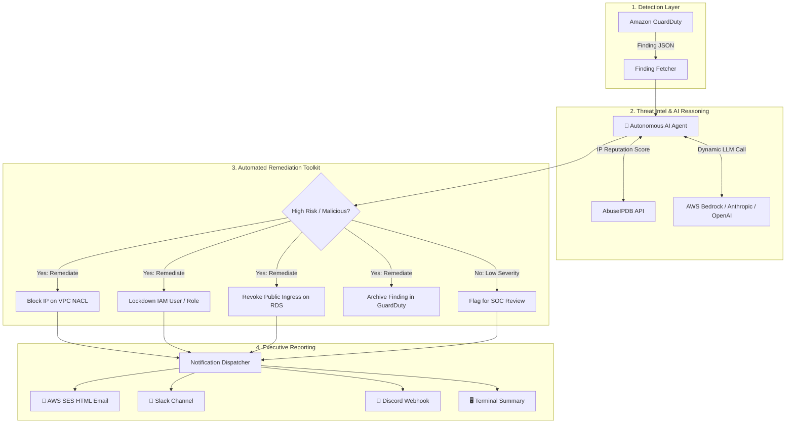

# AWS GuardDuty Autonomous AI Remediation Agent

[](https://github.com/your-username/guardduty-ai-remediator/actions)
[](https://www.python.org/downloads/)
[](https://github.com/pydantic/pydantic-ai)
[](https://opensource.org/licenses/MIT)
[](https://aws.amazon.com/bedrock/)
[](https://aws.amazon.com/ses/)

An autonomous, event-driven AI incident response framework that investigates, triages, and remediates Amazon GuardDuty security findings in real time using **PydanticAI**.

---

## Problem & Motivation

Modern Cloud Security Operations Centers (SOCs) face alert fatigue. When high-severity attacks occur (such as SSH brute forcing, credential exfiltration, or database exposure), manual triage can take hours. 

This project implements an **autonomous AI Security Agent** that:
1. **Pulls finding events** from AWS GuardDuty or EventBridge.
2. **Enriches findings** with external threat intelligence (AbuseIPDB reputation scores).
3. **PydanticAI Reasoning Engine**: Built on **PydanticAI** (`pydantic-ai`) for type-safe, schema-validated incident reasoning with zero JSON parsing boilerplate, dynamically supporting **AWS Bedrock**, **Anthropic (Claude 3.5 Sonnet)**, and **OpenAI (GPT-4o)**.
4. **Executes least-privilege containment actions**:
   - Blocks attacker IPs dynamically at the **VPC Network ACL (NACL)** level.
   - Quarantines compromised IAM users & roles by attaching emergency `DenyAll` policies and revoking active sessions.
   - Cleans up publicly exposed (`0.0.0.0/0`) ingress rules on Amazon RDS security groups.
   - Automatically archives resolved findings in Amazon GuardDuty.
5. **Multi-Channel Incident Dispatcher**: Sends responsive HTML email reports via **AWS SES**, messages to **Slack Webhooks**, and alerts to **Discord**.

---

## Architecture



---

## Dynamic Configuration (`.env`)

```ini
# ==============================================================================
# AWS Configuration
# ==============================================================================
AWS_DEFAULT_REGION=us-east-1
DRY_RUN=true                    # set to false for real AWS mutation

# ==============================================================================
# DYNAMIC AI PROVIDER: "bedrock", "anthropic", or "openai"
# ==============================================================================
LLM_PROVIDER=bedrock

# --- Provider 1: AWS Bedrock ---
BEDROCK_MODEL_ID=anthropic.claude-3-5-sonnet-20240620-v1:0
BEDROCK_REGION=us-east-1

# --- Provider 2: Anthropic API ---
ANTHROPIC_API_KEY=your-anthropic-api-key
ANTHROPIC_MODEL_ID=claude-3-5-sonnet-20241022

# --- Provider 3: OpenAI API ---
OPENAI_API_KEY=your-openai-api-key
OPENAI_MODEL_ID=gpt-4o

# ==============================================================================
# DYNAMIC NOTIFICATION CHANNELS
# ==============================================================================
# Channel 1: AWS SES Email (HTML Incident Report)
SES_SENDER_EMAIL=security-alerts@yourdomain.com
SES_RECIPIENT_EMAILS=soc@yourdomain.com,lead@yourdomain.com
SES_REGION=us-east-1

# Channel 2: Slack Webhook
SLACK_WEBHOOK_URL=https://hooks.slack.com/services/XXX/YYY/ZZZ

# Channel 3: Discord Webhook
DISCORD_WEBHOOK_URL=https://discord.com/api/webhooks/XXX/YYY
```

---

## Running the Agent

### 1. Run with AWS Bedrock
```bash
python3 cli.py --finding sample_guardduty_finding.json --llm bedrock
```

### 2. Run with Anthropic Claude API
```bash
export ANTHROPIC_API_KEY="sk-ant-..."
python3 cli.py --finding sample_guardduty_finding.json --llm anthropic
```

### 3. Run with OpenAI GPT-4o
```bash
export OPENAI_API_KEY="sk-proj-..."
python3 cli.py --finding sample_guardduty_finding.json --llm openai
```

### 4. Run with AWS SES Email Notification + Slack
```bash
python3 cli.py --finding sample_guardduty_finding.json \
  --ses-sender "security-alerts@yourdomain.com" \
  --ses-recipients "soc@yourdomain.com,lead@yourdomain.com" \
  --slack-webhook "https://hooks.slack.com/services/XXX/YYY/ZZZ"
```

### 5. Run Live Against AWS GuardDuty
```bash
python3 cli.py --aws --region us-east-1 --live --llm bedrock
```

---

## Automated Testing
```bash
pytest -v
```

---

## Resume & Interview Talking Points

* **Dynamic Multi-LLM Orchestration**: Implemented a swappable AI reasoning architecture using AWS Bedrock Converse API, Anthropic, and OpenAI to autonomously evaluate threat telemetry without vendor lock-in.
* **Closed-Loop Containment**: Automated blast-radius-aware remediation actions in AWS (NACL ingress blocking, IAM session invalidation, and RDS exposure mitigation).
* **Multi-Channel SOC Alerting**: Built an incident notification engine with formatted HTML email reports via AWS SES and real-time webhook alerts to Slack and Discord.
